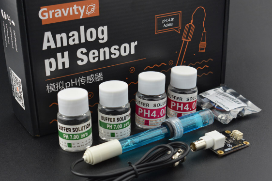

## DFRobot_PH

* [中文版](./README_CN.md)

This is the sample code for Gravity: Analog pH Sensor / Meter Kit V2, SKU:SEN0161-V2



## Product Link ([https://www.dfrobot.com/product-1782.html](https://www.dfrobot.com/product-1782.html))
    SKU: SEN0161-V2

## Table of Contents

  * [Summary](#summary)
  * [Installation](#installation)
  * [Methods](#methods)
  * [Compatibility](#compatibility)
  * [History](#history)
  * [Credits](#credits)

## Summary

Analog pH meter V2 is specifically designed to measure the pH of the solution and reflect the acidity or alkalinity. DFRobot ph sensor is commonly used in various applications such as aquaponics, aquaculture, and environmental water testing.

## Installation

To use this library, first download the library file, paste it into the \Arduino\libraries directory, then open the examples folder and run the demo in the folder.<br>
Depends library: https://github.com/DFRobot/DFRobot_EC


## Methods

```C++
  /**
   * @fn calibration
   * @brief Calibrate the calibration data
   *
   * @param voltage     : Voltage value
   * @param temperature : Ambient temperature
   * @param cmd         : enterph -> enter the PH calibration mode
   * @n                   calph   -> calibrate with the standard buffer solution, two buffer solutions(4.0 and 7.0) will be automaticlly recognized
   * @n                   exitph  -> save the calibrated parameters and exit from PH calibration mode
   */
  void    calibration(float voltage, float temperature,char* cmd);  //calibration by Serial CMD
  void    calibration(float voltage, float temperature);
  /**
   * @fn readPH
   * @brief Convert voltage to PH with temperature compensation
   * @note voltage to pH value, with temperature compensation
   *
   * @param voltage     : Voltage value
   * @param temperature : Ambient temperature
   * @return The PH value
   */
  float   readPH(float voltage, float temperature); 
  /**
   * @fn begin
   * @brief Initialization The Analog pH Sensor
   */
  void begin();
```

## Compatibility

MCU                | Work Well | Work Wrong | Untested  | Remarks
------------------ | :----------: | :----------: | :---------: | -----
Arduino Uno  |      √       |             |            | 
Leonardo  |      √       |             |            | 
Meag2560 |      √       |             |            | 
esp32 series   |              |     x       |            |

## History

- 2018/11/06 - Version 1.0.0 released.

## Credits

Written by Jiawei Zhang(jiawei.zhang@dfrobot.com), 2018. (Welcome to our [website](https://www.dfrobot.com/))
